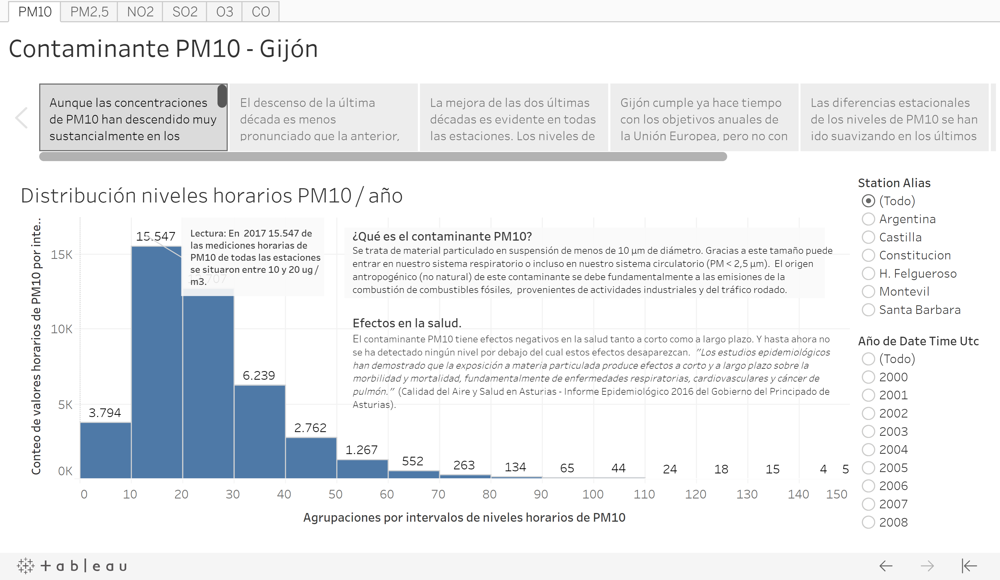
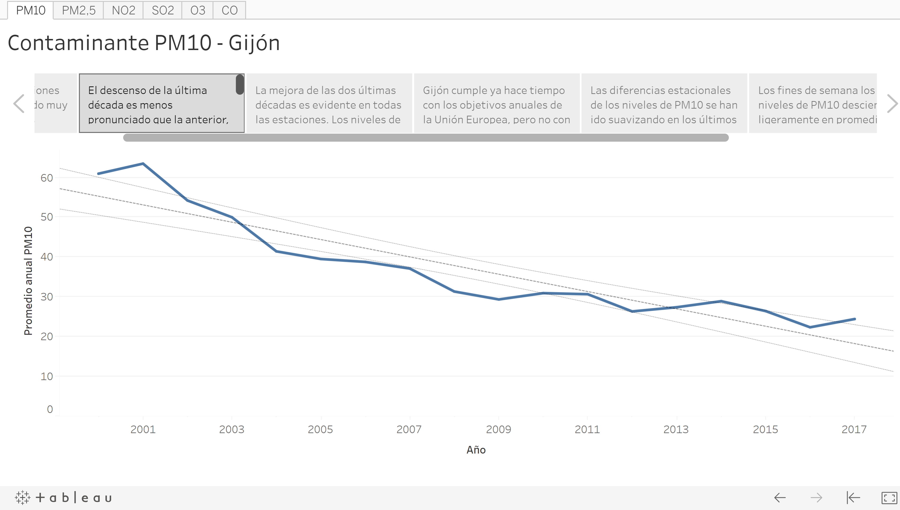

# Visualizations

To cover the first of this project goals, "*to construct a web dashboard to visualize the evolution of the main air pollution indicators of Gijon city*" I chose as main tool the [Tableau](https://www.tableau.com/) software. 

I created a Tableau story for each pollutant with Tableau Desktop (student license). And I published them on my [Tableau Public personal site](https://public.tableau.com/profile/sergioberdiales#!/). 

Each story shows a brief description of each pollutant, the evolution of its levels during the last two decades, the non-compliance with the EU standards or the WHO advice and several visualizations to show its seasonal components.

All the stories are saved in the same Tableau workbook. So, to access to each pollutant dashboard you only have to click on the correspondent tab.  

The datasets used on these visualizations were prepared with R code. You can consult this code in the section ***** of this document or in the Github repository of this project *****. 

__Tableau Public stories__:

If you want to consult the published stories on the Tableau site you only have to click on the link below:

* [Gijón Air Pollution](https://public.tableau.com/views/ContaminacinaireGijn/PM10?:embed=y&:display_count=yes)

The data visualization is a basic but powerful tool for any data science project. So, beyond the Tableau dashboards, I used the graphical visualizations of data for very different purposes. From basic data exploration - looking for quality data problems -, to look for data trends and seasonality or to check graphically the accuracy of a model. 

Some of these visualizations are included in this document but most of them are embedded in the R and Python code.

  
  
