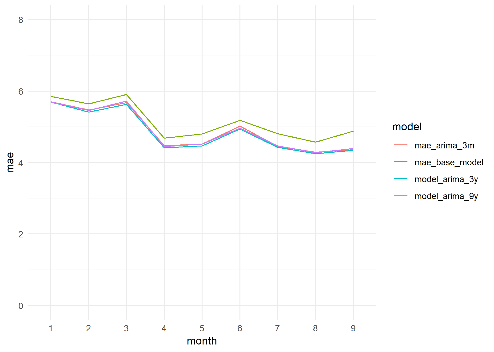

# Forecasting Models


```{r , warning= FALSE, message= FALSE, echo = FALSE}
library(readr)
library(dplyr)
library(tidyr)
library(purrr)
library(lubridate)
library(ggplot2)
library(stringr)
library(knitr)
library(xts)
library(zoo)
library(gridExtra)
library(astsa)
library(rvest)
library(fpp2)
library(ranger)
library(broom)
library(RcppRoll)
library(caret)
```

__"Prediction is very difficult, especially if it's about the future."__
 Nils Bohr, Nobel laureate in Physics
  
As I already explained in the Introduction, one of the objectives of this project is to develop forecasting models which permit us to predict with some hours in advance the pollution levels of Gijón city. 
  
Initially, I planned to create forecasting models for every monitoring station. But, as soon as I started to work on the models I realized this goal was not  very realistic. So, I adjusted the scope of my project to just one station, the Constitución station and only to two pollutants, PM10 and NO2. 
  
I chose the Constitución station because is the only station with weather data published. And we focused on these two pollutants because they are the pollutants with more impact in the public health. 
  
    
__Methodology.__

We make a first approximation to the problem with the ARIMA methodology. And then, with the reference of these results we try to improve the forecasts with machine learning methods. 

I used R for the ARIMA models and to prepare the training and testing datasets for the Python models.

And I used Python, on the Google Colab platform, to create the machine learning methods. 

All the R and Python scripts are saved in the [github repository project](https://github.com/sergioberdiales/TFM_KSchool_Gijon_Air_Pollution): 

* 10_train_test_datasets_1_PM10
* 10_train_test_datasets_1_NO2
* 12_Forecasting_Models_ARIMA_PM10.rmd
* 13_Forecasting_Models_ARIMA_NO2.rmd
* 21_Prediction_Models_ML_0_AR.ipynb
* 22_Forecasting_Models_ML_1_VAR.ipynb

The R scripts are included in this document too, in the _R code_ section. The Python notebooks are not included in this document but I included the links to the original Google Colab notebooks in the _Python code_ section.

## PM10 forecasts

### ARIMA results {-}

__"I have seen the future and it is very much like the present, only longer."__
Kehlog Albran, The Profit
  
#### R-markdown file "12_Forecasting_Models_ARIMA_PM10.rmd" {-}
  
  As first step I created a very simple model to use as a base reference. This model takes as prediction the value from the previous hour, forecasting just one hour ahead. So, the formula for this base model would be: Xt = Xt-1. 
  
Then, I generated three different seasonal (frequency: 24 hours) ARIMA models with three different training periods. 

And I applied these three models to the testing period data (2017-01-01 - 2017-09-30) in order to obtain their prediction accuracy scores for the one hour ahead forecast. 

Finally, I obtained the prediction accuracy scores for the ARIMA with the three years training period for the 6 hours, 12 hours and 24 hours ahead forecasts. 
  
In the table below we can see the R-squared and the MAE obtained for each ARIMA model tested for the PM10 pollutant. 

```{r  warning = FALSE, message= FALSE, echo = FALSE, out.width= '\\textwidth'}
PM10_ARIMA_results <- read_csv("data_final_csvs/PM10_ARIMA_results.csv")

PM10_ARIMA_results <- PM10_ARIMA_results %>%
                      mutate(`Prediction horizon` = factor(`Prediction horizon`, levels = c("1 hour", "6 hours", "12 hours", "24 hours"))) %>%
                      select(-`Target variable`, -`Test period`)

PM10_ARIMA_results_table <- kable(
  PM10_ARIMA_results, booktabs = TRUE,
  caption = 'ARIMA models results for the PM10 pollutant'
)

PM10_ARIMA_results_table
```

The base model (Xt = Xt-1) explains 53.3% of the variability of the data from the test period (R-squared: 0.5327) and it has a MAE (Mean Absolute Error) of 5.15. 

And the ARIMA model with the best results is the one with the 3 years training period, which improves in almost 7 points the Base model R-squared, explaining 60.15% of the variation in the levels of PM10 (one hour ahead) and reduces the MAE to 4.84.  

Either way, the differences between the three years training model and the other two are minimal. Three months of training data is explaining almost the same than three or nine years. 

We can see this very clearly in the graph below, where we plot the monthly MAE of each model over the testing period.



__Forecasting 6, 12 and 24 hours ahead__

The forecasting accuracy of any model decays as we try to forecast further in the future. 

```{r  warning = FALSE, message= FALSE, echo = FALSE, out.width= '\\textwidth'}
PM10_ARIMA_results_2 <- PM10_ARIMA_results %>% 
                        filter(`Train period` == "201401-201612")


PM10_ARIMA_results_table_2 <- kable(
  PM10_ARIMA_results_2, booktabs = TRUE,
  caption = 'ARIMA models results for the PM10 pollutant'
)

PM10_ARIMA_results_table_2
```

We plot the decrease of the R-Squared and the increase of the MAE when we extend the prediction horizon.

```{r  warning = FALSE, message= FALSE, echo = FALSE, out.width= '\\textwidth'}

r2_h_variation_plot <- ggplot(data = PM10_ARIMA_results_2, aes(x = `Prediction horizon`, y = `R-Squared`)) + 
  geom_point() +
  geom_text(aes(label=`R-Squared`), vjust=-0.4) +
  theme_minimal() +
  ylim(c(0, 0.7)) 

mae_h_variation_plot <- ggplot(data = PM10_ARIMA_results_2, aes(x = `Prediction horizon`, y = `MAE`)) + 
  geom_point() +
  geom_text(aes(label=`MAE`), vjust=-0.4) +
  theme_minimal() +
  ylim(c(0, 12))

grid.arrange(r2_h_variation_plot, 
             mae_h_variation_plot, 
             ncol = 1) 
       
```


### Machine Learning results {-}

  
[xkcd comic](https://xkcd.com/1838/)

#### Auto-regressive models {-}

_The code used for this section is in the Jupyter notebook file_ "21_Forecasting_Models_ML_PM10_AR.ipynb"
[Google Colab Notebook link "21_Forecasting_Models_ML_PM10_AR.ipynb"](https://colab.research.google.com/drive/1qlSLPiANjOcpngutSiq61GcCxRIe9eIT)

_The training, testing and validations dataset were prepared previously with R (Rmarkdown file "10_1_train_test_AR_datasets.rmd")._

In this part we try to emulate the ARIMA results with different auto-regressive machine learning models. 
So, we are only including as input variables lagged values of the target variable. In this case lagged values of the PM10 pollutant.

We used Linear Regression, Random Forests and XGBoost algorithms, achieving the best results with the XGBoost models. 

```{r  warning = FALSE, message= FALSE, echo = FALSE, out.width= '\\textwidth'}
PM10_ML_AR_results <- read_csv("data_final_csvs/PM10_ML_AR_results.csv")

PM10_ML_AR_results <- PM10_ML_AR_results %>%
                      mutate(`Prediction horizon` = factor(`Prediction horizon`, levels = c("1 hour", "6 hours", "12 hours", "24 hours")))

PM10_ML_AR_results_table <- kable(
  PM10_ML_AR_results, booktabs = TRUE,
  caption = 'ARIMA models results for the PM10 pollutant'
)

PM10_ML_AR_results_table
```

And as with the ARIMA models we got the smallest MAE using the three years period for the training dataset (2014-01-01 - 2016-12-31).
```{r  warning = FALSE, message= FALSE, echo = FALSE, out.width= '\\textwidth'}
PM10_ML_AR_results_2 <- PM10_ML_AR_results %>% 
                        filter(`Train period` == "201401-201612",
                               `Prediction horizon` == "1 hour",
                                `Number of variables` == "13")


PM10_ML_AR_results_2_table <- kable(
  PM10_ML_AR_results_2, booktabs = TRUE,
  caption = 'Machine learning models results for the PM10 pollutant'
)

PM10_ML_AR_results_2_table

```

Nevertheless, the results are very similar to the ARIMA ones for the one hour forecasts.
```{r  warning = FALSE, message= FALSE, echo = FALSE, eval = FALSE, out.width= '\\textwidth'}
PM10_ARIMA_results_3 <- PM10_ARIMA_results_2 %>% 
                         filter(`Prediction horizon` == "1 hour") %>%
                          select(`Model type`, `R-Squared`, `MAE`)

PM10_models_best_results <- PM10_ML_AR_results_2 %>% 
                          select(`Model type`, `R-Squared adjusted`, `MAE`) %>%
                          rename(`R-Squared` = `R-Squared adjusted`) %>%
                          bind_rows(PM10_ARIMA_results_3) %>%
                          mutate(`R-Squared` = round(`R-Squared`, 4))


PM10_arima_ml_r2 <- ggplot(data = PM10_models_best_results, aes(x = `Model type`, y = `R-Squared`)) + 
  geom_point() +
  geom_text(aes(label=`R-Squared`), vjust=-0.4) +
  theme_minimal() +
  ylim(c(0, 0.7))


PM10_arima_ml_mae <- ggplot(data = PM10_models_best_results, aes(x = `Model type`, y = `MAE`)) + 
  geom_point() +
  geom_text(aes(label=`MAE`), vjust=-0.4) +
  theme_minimal() +
  ylim(c(0, 11))

grid.arrange(PM10_arima_ml_r2, 
             PM10_arima_ml_mae, 
             ncol = 1) 
       
```
But as we increases the forecast horizon the XGBoost is obtaining better results than the ARIMA model.
```{r  warning = FALSE, message= FALSE, echo = FALSE, out.width= '\\textwidth'}

PM10_ARIMA_results_4 <- PM10_ARIMA_results_2 %>%
                          select(`Model type`, `Prediction horizon`, `R-Squared`, `MAE`)

PM10_ML_AR_results_3 <- PM10_ML_AR_results %>% 
                        filter(`Train period` == "201401-201612",
                                `Number of variables` == "13",
                                `Model type` == "XGBoost")


PM10_models_h1_h24 <- PM10_ML_AR_results_3 %>% 
                          select(`Model type`, `Prediction horizon`,`R-Squared adjusted`, `MAE`) %>%
                          rename(`R-Squared` = `R-Squared adjusted`) %>%
                          bind_rows(PM10_ARIMA_results_4) %>%
                          mutate(`R-Squared` = round(`R-Squared`, 4))


r2_h_variation_xgboost_arima_plot <- ggplot(data = PM10_models_h1_h24, aes(x = `Prediction horizon`, y = `R-Squared`, group = `Model type`, col = `Model type`, label=`R-Squared`)) + 
  geom_line() +
  geom_text(data = PM10_models_h1_h24[PM10_models_h1_h24$`Model type` == "ARIMA",] , vjust=+0.55, size = 3, show_guide = FALSE) +
  geom_text(data = PM10_models_h1_h24[PM10_models_h1_h24$`Model type` == "XGBoost",] , vjust=-0.55, size = 3, show_guide = FALSE) +
  theme_minimal() +
  ylim(c(0, 0.7))

mae_h_variation_xgboost_arima_plot <- ggplot(data = PM10_models_h1_h24, aes(x = `Prediction horizon`, y = `MAE`, group = `Model type`, col = `Model type`, , label=`MAE`)) + 
  geom_line() +
  geom_text(data = PM10_models_h1_h24[PM10_models_h1_h24$`Model type` == "ARIMA",] , vjust=+0.55, size = 3, show_guide = FALSE) +
  geom_text(data = PM10_models_h1_h24[PM10_models_h1_h24$`Model type` == "XGBoost",] , vjust=-0.55, size = 3, show_guide = FALSE) +
  theme_minimal() +
  ylim(c(0, 12))

grid.arrange(r2_h_variation_xgboost_arima_plot, 
             mae_h_variation_xgboost_arima_plot, 
             ncol = 1) 
       
```

#### Multi-variate models {-}

_The code used for this section is in the Jupyter notebook file_ "22_Forecasting_Models_ML_PM10_MULTIVAR.ipynb"
[Google Colab Notebook link "2_Forecasting_Models_ML_PM10_MULTIVAR.ipynb"](https://colab.research.google.com/drive/1qlSLPiANjOcpngutSiq61GcCxRIe9eIT)

_The training, testing and validations dataset were prepared previously with R (Rmarkdown file "10_2_train_test_MULTIVAR_datasets.rmd")._

And finally, we added other variables to try to improve our forecasting model. In this part we used exclusively the XGBoost algorithm, because so far it is the algorithm which showed the best performance. And because the same reason we will use the three years training period (2014-01-01). 

We used two different kinds of variables:

1. More lagged values of numerical variables, as weather measures or other pollutants levels.

2. Categorical variables related to information about the target that we can anticipate, as the hour of the day or the type of the day (working days versus non-working days).


```{r  warning = FALSE, message= FALSE, echo = FALSE, out.width= '\\textwidth'}
PM10_ML_MULTIVARIATE_results <- read_csv("data_final_csvs/PM10_ML_MULTIVARIATE_results.csv")

PM10_ML_MULTIVARIATE_results <- PM10_ML_MULTIVARIATE_results %>%
                      mutate(`Prediction horizon` = factor(`Prediction horizon`, levels = c("1 hour", "2 hours", "6 hours", "12 hours", "24 hours"))) %>% filter(`Prediction horizon` != "2 hours")

PM10_ML_MULTIVARIATE_results_table <- kable(
  PM10_ML_MULTIVARIATE_results, booktabs = TRUE,
  caption = 'ARIMA models results for the PM10 pollutant'
)

PM10_ML_MULTIVARIATE_results_table
```


```{r  warning = FALSE, message= FALSE, echo = FALSE, out.width= '\\textwidth'}


PM10_ML_MULTIVARIATE_results_2 <- PM10_ML_MULTIVARIATE_results %>% 
                                  select(-`Train period`) %>%
                                  rename(`R-Squared` = `R-Squared adjusted`)

PM10_models_h1_h24_2 <- PM10_models_h1_h24  %>%
                          bind_rows(PM10_ML_MULTIVARIATE_results_2) %>% 
                          mutate(`Prediction horizon` = factor(`Prediction horizon`, levels = c("1 hour", "6 hours", "12 hours", "24 hours")))


r2_h_variation_xgboost_arima_mv_plot <- ggplot(data = PM10_models_h1_h24_2, aes(x = `Prediction horizon`, y = `R-Squared`, group = `Model type`, col = `Model type`, label=`R-Squared`)) + 
  geom_line() +
  geom_text(data = PM10_models_h1_h24_2[PM10_models_h1_h24_2$`Model type` == "ARIMA",] , vjust=+0.55, size = 3, show_guide = FALSE) +
  geom_text(data = PM10_models_h1_h24_2[PM10_models_h1_h24_2$`Model type` == "XGBoost",] , vjust=-0.5, size = 3, show_guide = FALSE) +
  geom_text(data = PM10_models_h1_h24_2[PM10_models_h1_h24_2$`Model type` == "XGBoost MV",] , vjust=-1.2, size = 3, show_guide = FALSE) +
  theme_minimal() +
  ylim(c(0, 0.7))

mae_h_variation_xgboost_arima_mv_plot <- ggplot(data = PM10_models_h1_h24_2, aes(x = `Prediction horizon`, y = `MAE`, group = `Model type`, col = `Model type`, , label=`MAE`)) + 
  geom_line() +
  geom_text(data = PM10_models_h1_h24_2[PM10_models_h1_h24_2$`Model type` == "ARIMA",] , vjust=-0.55, size = 3, show_guide = FALSE) +
  geom_text(data = PM10_models_h1_h24_2[PM10_models_h1_h24_2$`Model type` == "XGBoost",] , vjust=+0.55, size = 3, show_guide = FALSE) +
  geom_text(data = PM10_models_h1_h24_2[PM10_models_h1_h24_2$`Model type` == "XGBoost MV",] , vjust=+1.5, size = 3, show_guide = FALSE) +
  theme_minimal() +
  ylim(c(0, 12))

grid.arrange(r2_h_variation_xgboost_arima_mv_plot, 
             mae_h_variation_xgboost_arima_mv_plot, 
             ncol = 1) 
       
```
